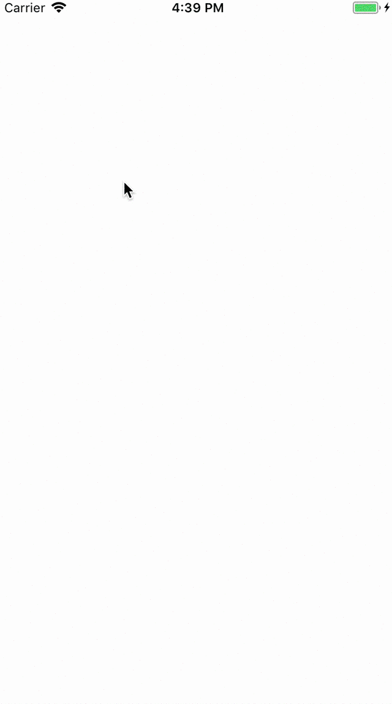

# Gradientable


[](http://cocoapods.org/?q=name%3AGradientable%20author%3AKofktu)
[](https://github.com/Carthage/Carthage)

- Gradiention Protocol in iOS



## Requirements
- iOS 9.0+
- Swift 4.0

## Installation

#### CocoaPods
Gradientable is available through [CocoaPods](http://cocoapods.org). To install
it, simply add the following line to your Podfile:

```ruby
pod 'Gradientable'
```

#### Carthage
For iOS 8+ projects with [Carthage](https://github.com/Carthage/Carthage)

```
github "Kofktu/Gradientable"
```

## Usage

#### Gradientable

```swift
public protocol Gradientable {
    public func set(options: GradientableOptions)
    public func set(animation: GradientableAnimation)
}

```

#### GradientableOptions

- Gradient color, location, direction


```swift
public struct GradientableOptions {
	var colors: [UIColor]?
	var locations: [NSNumber]?
	var direction: GradientableOptionsDirection?
}
```

#### GradientableAnimation

- Gradient color change animation

```swift
public struct GradientableAnimation {
	var from: [UIColor]?
	var to: [UIColor]
	var duration: TimeInterval = 0.4
}
```

## References
#### Please tell me or make pull request if you use this library in your application :) 

## Authors

Taeun Kim (kofktu), <kofktu@gmail.com>

## License

Gradientable is available under the ```MIT``` license. See the ```LICENSE``` file for more info.